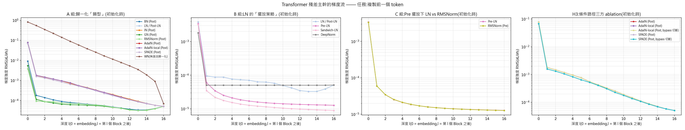
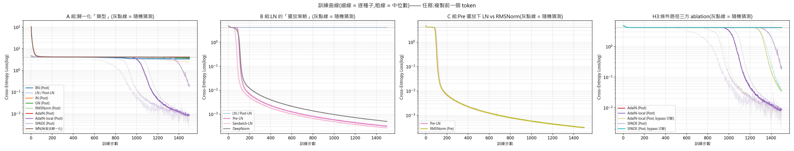
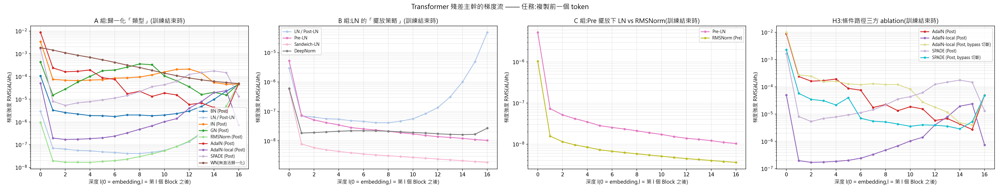
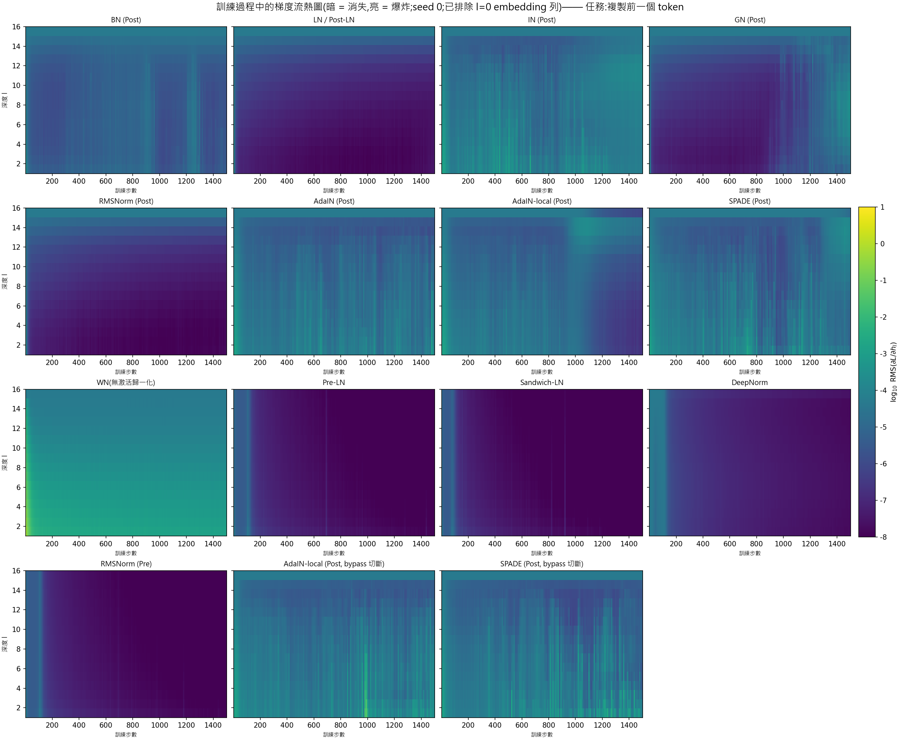
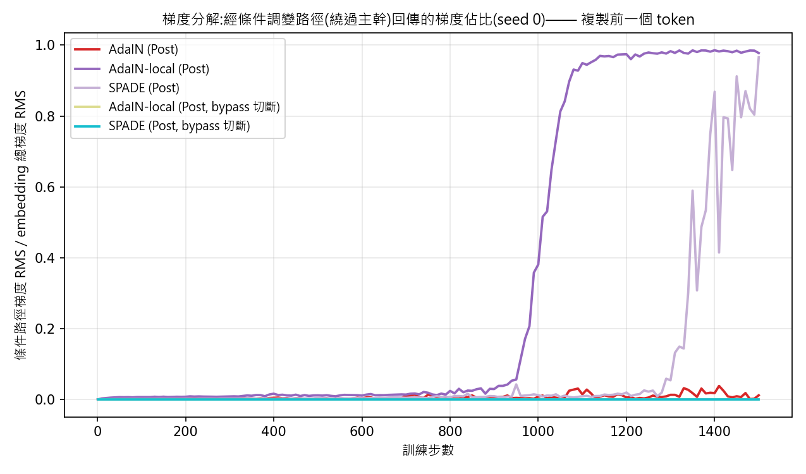
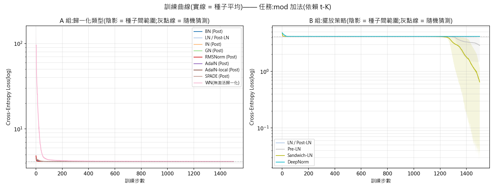
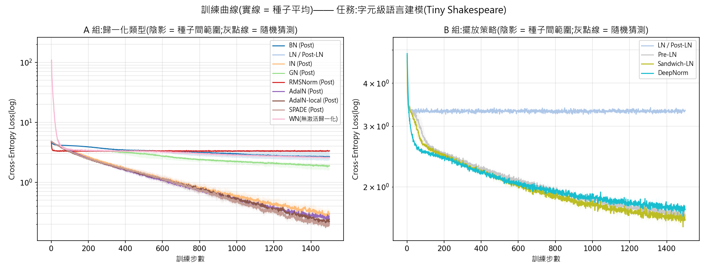

# Transformer Gradient Flow

> **專案目的**:探討同一個問題:**梯度在 Transformer 裡怎麼走、哪些設計會堵住它**。本專案以 12 種歸一化方法/擺放策略為切入點。
>這是一個**重現與視覺化型的實驗研究**-用嚴格控制變因的合成實驗,從梯度流的角度重現並視覺化權威論文(Xiong et al. 2020、Wang et al. 2022 等)的既有結論。
>對移植自影像生成領域的條件歸一化(AdaIN/SPADE),本專案附加了探索性的對照量測(梯度分解、條件粒度消融)  

>這算是一個嘗試做的一份研究實驗(?) 我不確定
>這份專案完成於我高中畢業後、升大學前的暑假，沒有指導。
>
> 這不是原創研究。核心結論:Post-LN 的梯度通路病灶、Pre-LN 的恆等捷徑、
> DeepNorm 的修復機制——均已見於 Xiong et al. (2020) 與 Wang et al. (2022)；
> 我做的是在受控的合成環境下重現並視覺化這些結論，用來確認自己是否真的理解了它們以及解決我自己的疑問。
>
> 有一點點原創性的部分是 AdaIN-local 的粒度消融（H3），  
> 但規模有限（3 種子、合成任務），且在 modk 任務上直接失效...  
> 我也不確定它的價值。

---

## 1. Question

**歸一化方法影響 Transformer 可訓練性的機制,究竟是「改變特徵分布」,還是「改變梯度回傳路徑」?**

## 2. Background:歸一化與梯度

### 2.1  Jacobian 的連乘

第 l 層收到的梯度是後面所有層 Jacobian 的連乘:

$$\frac{\partial L}{\partial h_l} = \frac{\partial L}{\partial h_N}\; J_N\, J_{N-1} \cdots J_{l+1}$$

連乘意味著:每層 Jacobian 的尺度只要系統性地偏離 1 一點點,乘 2N 次(每個 Block 有 attention 與 FFN 兩個子層)之後就是指數級失衡。

### 2.2 LN 的 Jacobian(推導)

對單一 token 的特徵 $x \in \mathbb{R}^d$,無仿射的 LayerNorm 為 $y = (x - \mu \mathbf{1})/\sigma$,其中 $\mu = \frac{1}{d}\mathbf{1}^\top x$、$\sigma^2 = \frac{1}{d}\|x-\mu\mathbf{1}\|^2 + \epsilon$。其 Jacobian 為:

$$\frac{\partial y}{\partial x} = \frac{1}{\sigma}\left(I - \frac{1}{d}\mathbf{1}\mathbf{1}^\top - \frac{1}{d}\,\hat{y}\hat{y}^\top\right),\qquad \hat{y} = \frac{x-\mu\mathbf{1}}{\sigma}$$

三個成分:**(a)** 整體縮放 $1/\sigma$;**(b)** 去均值投影 $I - \mathbf{1}\mathbf{1}^\top/d$;**(c)** 去半徑方向投影 $I - \hat{y}\hat{y}^\top/d$。投影項只削去兩個方向,對尺度影響微小;**主導梯度尺度的是 $1/\sigma$** —— 梯度反向穿過 LN 時,會被除以「前向激活的標準差」。

RMSNorm($y = x/\mathrm{rms}(x)$)的 Jacobian 是 $\frac{1}{r}(I - \hat{y}\hat{y}^\top/d)$:同樣的 $1/\sigma$ 結構,只少了去均值投影。**由此可預測:RMSNorm 與 LN 的梯度流行為應幾乎相同**(此預測在實驗中得到驗證,見發現 5)。

### 2.3 擺放位置決定梯度通路的形狀

| 策略 | 主幹單層 Jacobian | 梯度流含義 |
|---|---|---|
| **Post-LN**:`x = LN(x + F(x))` | $J_{\mathrm{LN}} \cdot (I + J_F)$ | $1/\sigma_l$ 卡在主幹上,連乘 2N 次;且 $\sigma_l$ 會隨訓練中殘差流的尺度漂移而變化,失衡可能自我強化 |
| **Pre-LN**:`x = x + F(LN(x))` | $I + J_F \cdot J_{\mathrm{LN}}$ | 恆等項保底:$\partial L/\partial h_l$ 至少包含 $\partial L/\partial h_N$ 的直達成分,不會指數衰減 |
| **Sandwich-LN**:`x = x + LN(F(LN(x)))` | $I + J_{\mathrm{LN}} J_F J_{\mathrm{LN}}$ | 保留恆等捷徑,並額外壓制分支輸出的前向尺度(CogView 用於抑制數值溢出) |
| **DeepNorm**:`x = LN(αx + F(x))`,$\alpha=(2N)^{1/4}$,V/O/FFN 初始權重乘 $\beta=(8N)^{-1/4}$ | $J_{\mathrm{LN}} \cdot (\alpha I + J_F)$ | 初始時 $J_F$ 被 β 壓小、LN 輸入由 αx 主導 ⇒ 整層 Jacobian 接近等距;DeepNet 論文的觀點是把單步模型更新量 bound 在常數級 |

### 2.4 條件歸一化:一條潛在的梯度旁路

AdaIN / SPADE 的仿射參數 γ、β 由**條件輸入**經一個淺網路生成。從反向傳播的角度看,這構成一條**不經過殘差主幹**的通路:loss 對條件的梯度,只需穿過「該層的調變運算 + 淺生成網路」即可回到條件來源。若主幹被 Post 擺放堵住,這條旁路是否能救活訓練?這是本專案新增的對照所要回答的問題(見假設 H3/H4 與梯度分解實驗)。

## 3. Hypotheses

- **H1(主假設)**:可訓練性主要由**梯度通路結構**決定,歸一化的統計維度(batch/序列/通道)是次要因素。
  *可檢驗預測:同一個 LN 換擺放位置造成的差異,遠大於同一擺放下換 9 種歸一化類型。*
  *(本專案設計只能檢驗「與 H1 一致/不一致」,無法排除前向激活尺度的混雜貢獻,見第 7 節第 6 點。)*
- **H2**:Post 擺放的失敗不是初始化瞬間的病灶,而是**訓練過程中主幹梯度逐步崩塌**的動態過程。
  *可檢驗預測:初始化時逐層梯度失衡溫和,訓練結束時劇烈。*
- **H3**:若條件歸一化(AdaIN/SPADE)能在 Post 擺放下逃脫,其梯度主要經由**條件調變路徑**回傳,且關鍵變因是條件的**粒度**(逐位置 vs 全域)。
  *可檢驗預測:梯度分解中條件路徑佔比顯著;逃脫時刻與佔比變化同步。粒度以三方消融孤立:AdaIN(全域向量)/ AdaIN-local(逐位置,與 AdaIN 唯一差別是不做平均池化)/ SPADE(逐位置 + 共享 MLP)。*
- **H4**:條件旁路只能在「位置內」調變,無法跨位置搬運資訊;解題所需的「取得前一格 token」仍必須由注意力完成。
  *可檢驗預測:成功收斂的模型,注意力對前一格的權重遠高於均勻基線 ≈ 0.059;且 AdaIN/SPADE 若收斂,同樣如此。*

## 4. Method

### 4.1 三個任務:從診斷探針到真實資料

本專案在**三個難度/真實度不同的任務**上跑完全相同的 12 配置 × 3 種子對照(各自輸出到 `results/<task>/`):

| 任務 | 定義 | 角色 |
|---|---|---|
| **copy** | `target[t] = x[t-1]`,token 均勻抽樣 | **診斷探針**:答案只在前一格,per-position 旁路無法單獨解題,必經注意力;未來 token 與答案獨立 |
| **modk** | `target[t] = (x[t] + x[t-16]) mod 64` | **長距離依賴**:答案同時需要本地的 x[t] 與 16 步前的 x[t-16],注意力必須跨 16 格搬運 |
| **char_lm** | Tiny Shakespeare 字元級語言建模,`target[t] = x[t+1]` | **真實資料**:檢驗合成任務的結論(擺放效應、梯度旁路)是否在真實分佈上重現 |

copy 任務的兩個關鍵性質(4.4 的注意力探測會驗證、不只靠論證):

1. **答案只存在於前一個位置**。FFN 與逐位置調變(AdaIN/SPADE 的 γβ)都只能取用位置 t 自己的資訊;跨位置搬運只有注意力做得到 ⇒ 解題必然經過注意力,梯度必然流經注意力機制。
2. token 均勻獨立抽樣 ⇒ 未來 token 與答案統計獨立(這對討論非因果歸一化的公平性很重要,見第 7 節)。modk 同樣滿足這兩個性質(答案全在過去);char_lm 的 target 在未來,對 IN/BN 家族有洩漏疑慮,見第 7 節第 2 點。

### 4.2 模型與控制變因

16 層、d_model=128、4 heads、d_ff=512、seq_len=64、batch=32。  
**所有配置共用**:初始化種子、資料流、Adam(lr=3e-4)、訓練步數(1500)、**刻意不加 warmup**(warmup 會遮住 Post-LN 的病灶,拿掉才觀察得到)。唯一變因為 歸一化方法/擺放策略。  
共 3 個隨機種子,摘要報 mean±std。

### 4.3 涵蓋的 12 種方法

**A 組:歸一化「類型」**(固定原始 Transformer 的 Post 擺放)

| 方法 | 統計維度(輸入 B×L×D) | 核心公式 | 出處脈絡 | 論文出處 |
|---|---|---|---|---|
| **BN** BatchNorm | 沿 (B, L),逐通道 | `(x-μ_c)/σ_c · γ + β` | CNN 標配;依賴 batch 統計 | Ioffe & Szegedy, *Batch Normalization: Accelerating Deep Network Training by Reducing Internal Covariate Shift*, ICML 2015 (arXiv:1502.03167) |
| **LN** LayerNorm | 沿 D,逐 token | `(x-μ)/σ · γ + β` | 原始 Transformer(Post-LN) | Ba, Kiros & Hinton, *Layer Normalization*, arXiv:1607.06450, 2016 |
| **IN** InstanceNorm | 沿 L,逐樣本逐通道 | 同 BN 但每樣本獨立 | 風格轉換 | Ulyanov, Vedaldi & Lempitsky, *Instance Normalization: The Missing Ingredient for Fast Stylization*, arXiv:1607.08022, 2016 |
| **GN** GroupNorm | 沿 (D/G, L),逐群組 | 通道分 G 組歸一化 | BN 的小 batch 替代品 | Wu & He, *Group Normalization*, ECCV 2018 (arXiv:1803.08494) |
| **RMSNorm** | 沿 D,逐 token | `x/RMS(x) · γ`(不減均值) | LLaMA / T5 | Zhang & Sennrich, *Root Mean Square Layer Normalization*, NeurIPS 2019 (arXiv:1910.07467) |
| **AdaIN** | IN + 條件**向量**調變 | `IN(x)·(1+γ(c)) + β(c)` | 風格轉換;γβ 由條件生成 | Huang & Belongie, *Arbitrary Style Transfer in Real-time with Adaptive Instance Normalization*, ICCV 2017 (arXiv:1703.06868) |
| **AdaIN-local** | IN + 條件逐位置調變 | 同 AdaIN 但**不做平均池化** | 本專案加入的粒度消融對照 | 無論文出處，自行設計的消融變體 |
| **SPADE** | IN + 條件**圖**逐位置調變 | `IN(x)·(1+γ_l(c)) + β_l(c)` | 語意影像合成 | Park, Liu, Wang & Zhu, *Semantic Image Synthesis with Spatially-Adaptive Normalization*, CVPR 2019 (arXiv:1903.07291) |
| **WN** WeightNorm | 作用在**權重**不在激活值 | `w = g·v/‖v‖`,激活不歸一化 | 唯一不碰激活值者 | Salimans & Kingma, *Weight Normalization: A Simple Reparameterization to Accelerate Training of Deep Neural Networks*, NeurIPS 2016 (arXiv:1602.07868) |

**B 組:LN 的「擺放策略」**(見 2.3 表)——Post-LN、Pre-LN、Sandwich-LN、DeepNorm。

### 4.4 三種量測工具

1. **逐層梯度流**:對殘差主幹每層之後的 hidden state $h_l$ 呼叫 `retain_grad()`,backward 後記錄 $\mathrm{RMS}(\partial L/\partial h_l)$——初始化時、訓練全程每 10 步、訓練結束時。
2. **梯度分解**(檢驗 H3):條件圖 `cond = x.clone()` 是獨立的 autograd 節點(數值恆等、不改變任何計算),`cond.grad` 即「僅經條件調變路徑」回到 embedding 的梯度;與 embedding 總梯度相比得到**旁路佔比**。這把「SPADE 靠捷徑」從推論變成直接量測。
3. **注意力探測**(檢驗 H4):顯式計算各層注意力矩陣,量測 attend 到「目標所在相對位置」(copy/char_lm:t−1;modk:t−16)的平均權重(init vs final),與該位移下的均勻注意力基線比較(copy ≈ 0.059、modk ≈ 0.028、char_lm ≈ 0.059)。

## 5. Results

### 5.1 主任務 copy(診斷探針)

> 16 層、1500 步、lr=3e-4、無 warmup、3 種子(mean±std)。
> 兩條基線:隨機猜測 loss = ln(64) ≈ **4.159**;注意力對前一格的均勻基線 ≈ **0.059**。
> 「attn→前一格」= 各層中最大的「attend 到前一個位置的平均注意力權重」,量測模型是否真的用注意力解題。

| 配置 | 初始梯度比(底/頂) | 最終 loss | attn→前一格 | 條件路徑梯度佔比(最終) |
|---|---:|---:|---:|---:|
| LN / Post-LN | 69 ± 6 | 4.1619 ± 0.0005 | 0.064(=基線) | — |
| RMSNorm (Post) | 71 ± 3 | 4.1618 ± 0.0006 | 0.064(=基線) | — |
| AdaIN (Post) | 1582 ± 288 | 4.1494 ± 0.0003 | 0.072(~=基線) | **0.002** |
| AdaIN-local (Post) | 1581 ± 288 | **0.0088 ± 0.0007** | 0.294 ± 0.067 | **0.983** |
| GN (Post) | 107 ± 10 | 3.79 ± 0.32 | 0.156 ± 0.070 | — |
| IN (Post) | 1641 ± 270 | 3.58 ± 0.82 | 0.127 ± 0.091 | — |
| BN (Post) | 160 ± 13 | 3.46 ± 0.24 | 0.154 ± 0.060 | — |
| SPADE (Post) | 1397 ± 113 | 1.11 ± 1.42 | **0.289 ± 0.037** | **0.982** |
| Pre-LN | 268 ± 30 | **0.0003 ± 0.0000** | 0.606 ± 0.008 | — |
| Sandwich-LN | 348 ± 35 | **0.0003 ± 0.0000** | 0.544 ± 0.002 | — |
| DeepNorm | **35 ± 0**(最平坦) | **0.0005 ± 0.0000** | 0.913 ± 0.004 | — |

> **WN(無激活歸一化)不列入主表**:其最終 loss 為 4.0773 ± 0.0087(注意力停在基線),但失敗同時混雜**前向尺度爆炸**(初始 loss ≈ 120,logits 溢出)與**反向梯度放大**(初始底/頂比 10944 ± 1030,log 圖上呈教科書式指數直線)。兩個效應無法分離,與主表其他配置不是同一種「病」,放在一起比較會誤導,詳見第 7 節第 3 點。

**種子層級的細節**(對解讀很重要):

- **B 組三種通路修復策略跨種子幾乎零變異**(±0.0000),每個種子都在 ~150 步內收斂——在本設定下修復效果是**穩健的**。
- **A 組的「部分逃逸」對種子高度敏感**:IN 三個種子的最終 loss 是 [2.43, 4.16, 4.16](只有 1/3 逃脫);SPADE 是 [0.21, 3.11, 0.006];BN [3.43, 3.76, 3.17];GN [3.83, 4.16, 3.37]。「逃/不逃」看起來像接近某種臨界點的隨機事件,但 **3 個種子不足以刻畫其分布**——要把「逃脫機率」當成量來研究,需要 10–20 種子並掃描深度/學習率(見 Limitations),此處僅如實報告觀察。
- **LN 與 RMSNorm 是最穩定的「失敗」**:三個種子全部精確卡在隨機水準,注意力探測值 = 未訓練基線——模型從頭到尾沒有學會使用注意力。
- **粒度消融的三方對照乾淨利落**:AdaIN(全域池化)3/3 種子卡死(4.149);AdaIN-local(唯一差別 = 不池化)3/3 種子收斂(0.0088 ± 0.0007);SPADE(逐位置 + MLP)2~3/3 種子部分逃脫且變異大。在本設定下,「條件粒度」是決定旁路是否被使用的關鍵變因;AdaIN-local 比 SPADE 更穩定,推測直接線性生成(無 MLP 瓶頸)讓旁路更容易被優化器利用,但此點未做進一步消融。







### 5.2 跨任務驗證:modk(長距離)與 char_lm(真實資料)

最終 loss(3 種子 mean±std;copy/modk 的隨機基線 = ln 64 ≈ 4.159):

| 配置 | copy | modk(K=16) | char_lm |
|---|---:|---:|---:|
| LN / Post-LN | 4.1619 ± 0.0005 | 4.1620 ± 0.0007 | 3.321 ± 0.022 |
| RMSNorm (Post) | 4.1618 ± 0.0006 | 4.1620 ± 0.0008 | 3.321 ± 0.022 |
| BN (Post) | 3.46 ± 0.24 | 4.1604 ± 0.0019 | 2.66 ± 0.45 |
| GN (Post) | 3.79 ± 0.32 | 4.1590 ± 0.0000 | 1.87 ± 0.20 |
| IN (Post) | 3.58 ± 0.82 | 4.1592 ± 0.0000 | 0.29 ± 0.05 * |
| AdaIN (Post) | 4.1494 ± 0.0003 | 4.1595 ± 0.0004 | 0.25 ± 0.01 * |
| AdaIN-local (Post) | 0.0088 ± 0.0007 | 4.1592 ± 0.0000 | 0.22 ± 0.02 * |
| SPADE (Post) | 1.11 ± 1.42 | 4.1593 ± 0.0003 | 0.20 ± 0.00 * |
| WN(無激活歸一化) | 4.077 ± 0.009 | 4.1719 ± 0.0010 | 2.58 ± 0.04 |
| Pre-LN | 0.0003 ± 0.0000 | 2.93 ± 1.05 | 1.663 ± 0.009 |
| Sandwich-LN | 0.0003 ± 0.0000 | **0.71 ± 0.52** | **1.618 ± 0.008** |
| DeepNorm | 0.0005 ± 0.0000 | 4.1618 ± 0.0007 | 1.732 ± 0.007 |

(* : 受未來資訊洩漏污染,見下方第 2 點,**不可作為方法優劣證據**)

**跨任務的三個要點:**

1. **擺放效應(H1)在真實資料上重現。** char_lm 中,Post-LN/RMSNorm 的注意力從頭到尾停在均勻基線(0.061 vs 基線 0.059)、loss 卡在 3.32——此為「僅依賴 embedding/head 學到區域統計、注意力從未成形」的水準;Pre-LN/Sandwich/DeepNorm 則收斂至 1.6~1.7,注意力明顯成形(0.25~0.37)。同一種 LN、僅更換位置,在真實資料上仍構成決定性差異。

2. **char_lm 直接驗證了第 7 節預警的「未來洩漏」。** IN 家族四個配置(IN/AdaIN/AdaIN-local/SPADE)在 char_lm 上 loss 全數掉至 0.20~0.29 nats——**遠低於** Pre-LN 的 1.66,低至不合理的程度(此規模的字元模型正常應在 0.7 nats 以上),且四條曲線幾乎重合、與有無條件調變無關。此現象與「IN 的序列統計包含 x[t+1],模型經過 16 層後學會將聚合統計放大為逐位置解碼」的洩漏解釋一致。我們原先推測「聚合統計對單一字元的資訊量甚低」——**數據推翻了這個推測**:洩漏通道會被優化器主動放大。因此 char_lm 上 IN 家族的數字**不能**用於檢驗 H3;它們反而構成「非因果統計不可用於自迴歸模型」的直接實驗證據。

3. **modk 揭示旁路救援(H3)的邊界——其效果具有任務相依性。** 在需要精確 16 步對位的長距離任務上,A 組全數失敗(皆為隨機水準、注意力為基線 0.028)——包括在 copy 任務上 3/3 成功逃脫的 AdaIN-local 與 SPADE。旁路能將梯度送回底層,卻無法取代「注意力頭形成精確的 −16 對位」這一步;當任務對注意力結構的要求更高時,僅靠旁路已不足以逃脫。僅有恆等捷徑擺放取得進展:Sandwich 0.71 ± 0.52(種子間差異大)、Pre-LN 2.93 ± 1.05(部分種子剛起步)。值得注意的是 **DeepNorm 在 1500 步內亦未能逃離**(注意力未成形)——此與其解釋方向一致:α 放大殘差、β 壓小分支,使注意力分支初期貢獻極小,因而難以形成長距離對位;惟此僅為推測,亦可能只是需要更多步數。





## 6. Discussion

### 6.1 逐假設檢驗

**H1(通路 > 統計維度)— 結果與假設一致,但有一個未解耦的混雜因素。**
同一個 LN,換擺放位置的效應(4.16 → 0.0003,四個數量級)遠大於同一擺放下換遍 9 種歸一化類型的效應(全部落在 1.1~4.2 的區間)。DeepNorm 是本設計中最乾淨的對照:它**不改變 Post 結構、只調整 α/β 縮放**,就把「完全卡死」修成與 Pre-LN 相同的收斂品質——這與「病灶在梯度通路而非 LN 運算本身」的解釋一致。
但必須指出:DeepNorm 與 Pre-LN 都**同時**改變了前向激活尺度、反向梯度尺度與殘差權重比例,本實驗沒有把「前向尺度受控」和「反向通路暢通」兩個因素拆開(需要類似「Post-LN + 激活重縮放」的對照,見第 7 節第 6 點)。因此嚴格的表述是「證據與梯度通路觀點一致」,而不是「證明了梯度通路是主要機制」。

**H2(訓練中崩塌)— 結果支持。**
初始化時 Post-LN 的底/頂梯度比只有 69×(溫和),但訓練結束時頂層與中層的梯度差距拉大到三個數量級以上(`grad_flow_final.png` 右圖);熱圖顯示中低層在前 100 步內變暗且再未恢復。失衡是在訓練中自我強化的動態過程,而不是初始化的瞬間病灶。(判讀熱圖時注意:B 組在 ~200 步後也變暗,但那伴隨 loss 收斂到 10⁻³——梯度小是任務解完,不是訊號受阻。)

**H3(條件路徑 = 梯度捷徑,粒度是關鍵)— 三方消融的結果與假設一致。**
梯度分解顯示:逃脫的條件歸一化配置中,條件路徑的梯度佔比在 loss 跳水的**同一時刻**從 ~0 暴增到 0.98(`cond_path_share.png`;AdaIN-local 約在第 1000 步、SPADE 約在第 1300 步)——訓練末期回到 embedding 的梯度幾乎全部繞過殘差主幹。而 AdaIN 的條件路徑佔比全程 ≈ 0.002 且模型卡死:**旁路在結構上存在,不代表優化器會使用它**。
關鍵對照是 AdaIN-local:它與 AdaIN 的**唯一**差別是不做序列平均池化(γ/β 逐位置生成),結果從 3/3 卡死(4.149)變成 3/3 收斂(0.0088)。這把「粒度是關鍵變因」從推測變成受控對照的結果——全域池化摧毀了逐位置資訊,使旁路傳不了對逐位置任務有用的訊號,零初始化的 γ/β 生成層因此從未被放大。剩餘未解耦的因素:SPADE 額外的共享 MLP(容量/非線性)似乎反而讓逃脫更不穩定(2~3/3、高變異),原因未探究。
**範圍限定(來自跨任務驗證,5.2)**:旁路逃生是**任務相依**的——在需要精確 16 步對位的 modk 任務上,AdaIN-local 與 SPADE 全部卡死。旁路能把梯度送回底層,但不能代替注意力頭形成精確的長距離對位;H3 的成立範圍目前僅確認於 copy 這類短距離、逐位置任務。

**H4(注意力不可繞過)— 結果支持,直接回應「SPADE 是否繞過注意力解題」的質疑。**
所有逃脫的 run,注意力對目標位置的權重都遠高於均勻基線(copy 基線 0.059):SPADE 三個種子為 0.24~0.32,AdaIN-local 為 0.24~0.39,Pre-LN 0.61,DeepNorm 0.91;所有卡死的 run 都停在基線。跨任務同樣成立:modk 上有進展的 Sandwich/Pre-LN 對 −16 位置的注意力達 0.44/0.39(基線 0.028),卡死的配置全部停在 0.03;char_lm 上 Post-LN/RMS 停在基線 0.061 而收斂的擺放達 0.25~0.37。條件歸一化**沒有**繞過注意力——條件旁路只能在位置內調變(位置 t 的條件不含 token t-1 的資訊),「搬運答案」仍由注意力完成。旁路的作用是**把健康的梯度送回底層**,讓注意力層獲得可用的學習訊號。「條件資訊直接豐富了表示、模型不需要注意力」的替代解釋與數據不符:AdaIN 同樣擁有條件資訊,但注意力停在基線、loss 卡死。

### 6.2 用梯度流重新分類 12 種方法

(此分類是本實驗觀察的整理,不是嚴格的理論分類)

| 分類 | 方法 | 行為特徵 |
|---|---|---|
| **通路修復型**(本設定下穩健) | Pre-LN、Sandwich-LN、DeepNorm | 恆等捷徑或等效縮放;跨種子零變異、快速收斂 |
| **旁路逃生型** | AdaIN-local(3/3 種子)、SPADE(部分種子) | 主幹仍堵塞,但條件旁路確實載了梯度(佔比 0→0.98) |
| **統計補償型**(對種子敏感) | BN、GN、IN | 改變失衡的形狀與幅度,個別種子能部分逃逸,不可靠 |
| **無效型** | Post-LN、RMSNorm(Post)、AdaIN(旁路閒置)、WN(前向/反向尺度皆失控) | 跨種子穩定地卡在隨機水準 |

### 6.3 與文獻的關係

H1、H2 的核心結論(Post-LN 的通路病灶、Pre-LN 的恆等捷徑、DeepNorm 的修復)**都是既有文獻的結果**:Xiong et al. (2020) 已給出理論分析,Wang et al. (2022) 已證明 DeepNorm——本專案做的是用一個乾淨的合成任務把這些理論**重現並視覺化**,不是新知識。本專案自行設計的部分是三個補充對照:(1) 把 BN/IN/GN/AdaIN/SPADE/WN 這些跨領域方法放進**同一個受控框架**同框對照;(2) 用**梯度分解**把「條件調變 = 梯度旁路」從概念變成可量測的量,並觀察到它與逃脫時刻的同步性;(3) 用 AdaIN / AdaIN-local / SPADE 的**粒度消融**孤立「條件粒度」變因;(4) 用**注意力探測**檢驗「繞過注意力」的替代解釋。這些屬於探索性的延伸量測,結論的外推性受第 7、8 節所列限制約束。

### 6.4 總結

在本實驗的範圍(三個小規模任務、16 層、3 種子)內,證據與以下觀點一致:**不同歸一化方法對可訓練性的影響差異,更多來自梯度回傳路徑的結構(恆等捷徑、殘差縮放、旁路),而非特徵分布的統計性質本身**。跨任務驗證進一步劃出邊界:擺放效應(H1)在合成探針與真實資料上都重現;旁路逃生(H3)只在短距離逐位置任務上成立,任務難度提高時,恆等捷徑是唯一在預算內有進展的通路設計。由於前向尺度與反向通路尚未解耦(6.1 H1、第 7 節第 6 點),這應理解為對既有文獻觀點的**重現**,而非新的證明。

## 7. 方法論註記(Threats to Validity)

1. **AdaIN/SPADE 的「條件」是自產的**(cond = embedding 輸出),等於人為外掛了一條旁路。這正是研究對象:把影像生成的條件歸一化移植到自迴歸任務時,「條件從哪來」本來就是設計決策;本專案用梯度分解把這條旁路從**隱藏的設計副作用**變成**顯式的量測對象**。原生應用(風格圖/分割圖)中的外部條件,其梯度旁路結構與此同構。
2. **BN/IN/GN 的統計沿序列計算,包含未來位置**(表示不因果)。對「作弊」疑慮的回應需分任務討論:**copy/modk** 的 target 全在過去、token 獨立均勻抽樣,未來成分是與答案無關的雜訊,無法降低 loss 下限,洩漏疑慮不成立;**char_lm** 的 target[t] = x[t+1] 本身就在歸一化統計的計算範圍內,IN/BN 家族(含 AdaIN/SPADE 內部的 IN)存在**真實的未來洩漏**而且實驗顯示洩漏被優化器**主動放大**:IN 家族在 char_lm 掉到 0.2~0.3 nats,遠低於因果模型的合理水準(見 5.2 第 2 點)。「聚合統計資訊量低、影響不大」的直覺被數據證偽。因此 char_lm 上 IN/BN 家族的 loss **不可**與 LN 系比較;B 組(全 LN、逐 token 統計)完全因果、不受影響。此外表示不因果使這些方法**不能直接用於自迴歸生成**(需要因果化/串流統計),本專案的結論僅限訓練動態層面。
3. **WN 組存在混雜效應**:沒有激活歸一化時,前向尺度失控(初始 loss ≈ 120,logits 爆炸)與反向梯度放大同時發生,無法把失敗乾淨地歸因給梯度流單一因素。WN 組的正確解讀是:「激活歸一化同時承擔前向與反向的尺度控制」,而非單獨支持 H1。
4. **部分逃逸的中間結果(BN/GN/IN)對隨機性敏感**:已用 3 種子報 mean±std,但種子數仍少,這些配置的排序不應被過度解讀。
5. **初始化時的逐層梯度比較有量綱陷阱**:Pre/Sandwich 有 final LN、Post 沒有,輸出端梯度尺度本身不同;因此我們主要比較**形狀**(逐層趨勢、底/頂比值)而非絕對值。
6. **「前向尺度」與「反向通路」未解耦**:所有成功的配置(Pre-LN/Sandwich/DeepNorm)都同時改善了前向激活尺度與反向梯度通路,本實驗無法排除「前向尺度受控才是主因」的替代解釋。要分離兩者,需要諸如「Post-LN + 逐層激活重縮放 + 梯度裁剪」的對照實驗——若激活尺度被人工控制後 Post-LN 仍然卡死,梯度通路的歸因才算閉環。此對照不在本專案範圍內,是最值得補的一個實驗。

## 8. Limitations

- 任務涵蓋診斷探針(copy)、長距離依賴(modk)與小型真實資料(char_lm 字元級語言建模),但仍是**單一規模**(16 層、~3.2M 參數、單一資料集):對詞級語言建模、翻譯、影像任務,以及百層/十億參數規模的外推性**未經驗證**。Xiong et al. (2020) 與 Wang et al. (2022) 的結果提示大方向一致,但本專案自身不構成證據。
- 種子數 3 對高變異配置(SPADE/IN/BN/GN)只夠報告現象,不足以估計「逃脫機率」;把逃脫當成隨機事件研究(機率 vs 深度/學習率)需要 10–20 種子。
- 「前向尺度 vs 反向通路」未解耦(見第 7 節第 6 點),這是本設計最大的歸因缺口。
- 未涵蓋 warmup、梯度裁剪、學習率調度等實務補救手段與歸一化的交互作用。
- 理論部分只到 Jacobian 尺度分析的層級,未做譜半徑/Lipschitz 常數的嚴格推導。


## 9. 執行方式

```bash
pip install -r requirements.txt
python run_experiment.py --task copy      # 預設任務;16 層、1500 步、3 種子、自動選 CUDA
python run_experiment.py --task modk      # 長距離依賴任務(K=16,可用 --modk-gap 調)
python run_experiment.py --task char_lm   # 真實資料任務(自動下載 Tiny Shakespeare)
python run_experiment.py --task copy --replot          # 不重訓,直接重畫圖表
python run_experiment.py --task copy --only adain_loc  # 增量模式:只訓練指定配置
python run_experiment.py --steps 300 --seeds 1 --layers 12 --device cpu   # 自訂
```

輸出(每個任務一個資料夾 `results/<task>/`):

| 檔案 | 內容 |
|---|---|
| `grad_flow_init.png` | 初始化時逐層梯度 RMS(seed 0) |
| `grad_flow_final.png` | 訓練結束時逐層梯度 RMS(seed 0) |
| `training_loss.png` | 訓練曲線(實線 = 種子平均,陰影 = 種子間範圍) |
| `grad_flow_heatmaps.png` | 「層 × 訓練步」梯度熱圖(seed 0) |
| `cond_path_share.png` | 條件路徑梯度佔比隨訓練的變化(AdaIN 家族/SPADE) |
| `summary.csv` / `metrics.json` | 數值摘要(mean±std)與完整原始數據 |

## 10. 檔案結構

```
Normalization-Gradient-Flow/
├── normalizations.py   # 歸一化的統一介面實作(BN/LN/IN/GN/RMS/AdaIN/AdaIN-local/SPADE/WN)
├── model.py            # MHSA、五種擺放策略的 Block、TransformerLM(含梯度分解與注意力探測掛點)
├── run_experiment.py   # 三個任務 + 訓練 + 三種梯度探測 + 多種子 + 繪圖 + 摘要
├── requirements.txt
├── README.md
├── data/               # Tiny Shakespeare 語料(首次執行 char_lm 時自動下載)
└── results/            # 產出的圖表與數據(copy/ modk/ char_lm/ 各一夾)
```

## 11. 參考文獻

- Ba et al., *Layer Normalization*, 2016
- Xiong et al., *On Layer Normalization in the Transformer Architecture*, ICML 2020(Post-LN vs Pre-LN 的理論分析)
- Zhang & Sennrich, *Root Mean Square Layer Normalization*, NeurIPS 2019
- Wang et al., *DeepNet: Scaling Transformers to 1,000 Layers*, 2022(DeepNorm)
- Ding et al., *CogView: Mastering Text-to-Image Generation via Transformers*, NeurIPS 2021(Sandwich-LN)
- Huang & Belongie, *Arbitrary Style Transfer in Real-time with Adaptive Instance Normalization*, ICCV 2017
- Park et al., *Semantic Image Synthesis with Spatially-Adaptive Normalization*, CVPR 2019
- Salimans & Kingma, *Weight Normalization*, NeurIPS 2016
- Wu & He, *Group Normalization*, ECCV 2018
- Ioffe & Szegedy, *Batch Normalization*, ICML 2015
